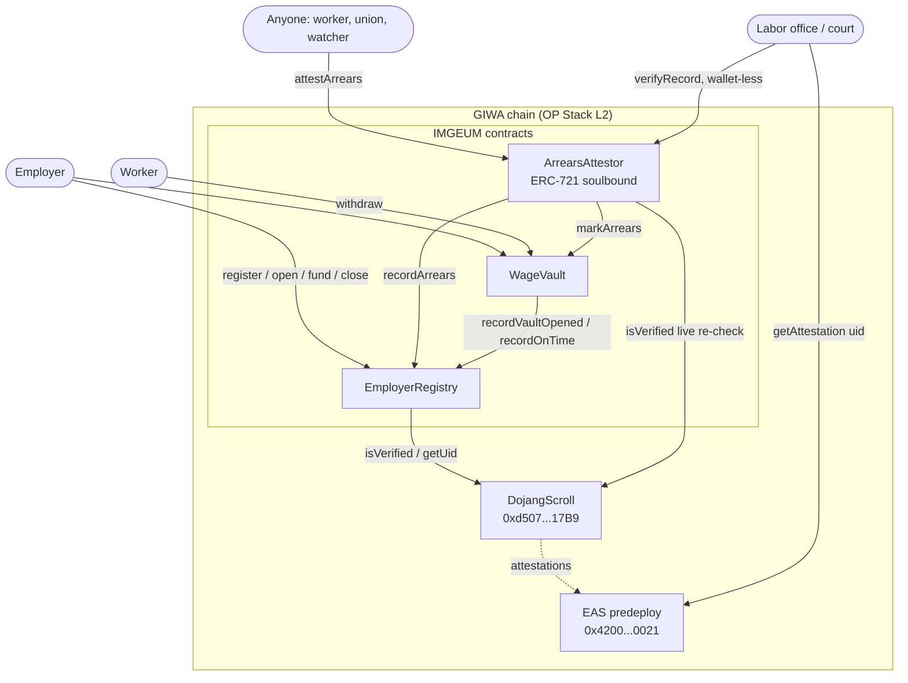

# IMGEUM — Architecture

> **한국어 요약.** IMGEUM은 두 계층으로 구성됩니다: (1) 사업주가 시간에 비례해 임금을 스트리밍하는
> `WageVault` 에스크로, (2) 지급 기한에 부족분이 발생하면 누구나 영구 온체인 증빙을 발행하는
> `ArrearsAttestor`. 신원은 `EmployerRegistry`가 GIWA의 Dojang 검증 주소로 게이트합니다. 볼트는
> 팩토리 클론이 아닌 **단일 컨트랙트 + 구조체** 방식으로, 가스·인덱싱·감사 용이성을 위해 선택했습니다.
> 스트림 수학의 핵심 불변식(출금 ≤ 적립 ≤ 임금, 예치 ≥ 출금)과 단일 컨트랙트 지급여력 불변식이
> 퍼즈·불변식 테스트로 검증됩니다. 아래 본문은 영어입니다(개발자 대상).

---

## 1. System overview



**Data flow, event-driven frontend.** The web app never polls blindly. It subscribes to
`VaultFunded` / `Withdrawn` / `ArrearsAttested` via viem `watchContractEvent` and batches vault
reads through `vaultSnapshot`, refetching on GIWA's 1-second cadence. The earned-wage counter is
interpolated **client-side at 60fps** between block reads using a byte-for-byte mirror of the
Solidity `_earned` formula (`web/src/lib/vault.ts`), so money visibly ticks every frame while the
chain remains the sole source of truth.

---

## 2. Contract-by-contract design

### 2.1 `EmployerRegistry`

Identity + public payment history.

- **Registration is a pull-check, not a proof submission.** GIWA's docs show Dojang verification
  as `DojangScroll.isVerified(msg.sender, attesterId)` — the contract reads the attestation
  directly. **This deviates from the build spec's assumed `register(bytes proof, …)` signature;
  per the "docs win" rule we dropped the proof argument.** Accepting a caller-supplied proof would
  be strictly less safe (a caller could submit someone else's proof). Flagged in
  `interfaces/IDojangVerifier.sol`.
- **The Dojang UID is snapshotted at registration** and never recomputed, so evidence can cite the
  attestation that was live when a vault opened even after later revocation. A separate
  `isCurrentlyDojangVerified` gives the live view; the evidence page shows both.
- **Solvency score** (`solvencyScore`, 0–1000) is fully deterministic — no oracle, no owner input:

  ```
  settled = onTimeCount + arrearsCount
  base    = 1000 * onTimeCount / settled                       # lifetime on-time ratio
  penalty = MAX_RECENCY_PENALTY * (WINDOW - age) / WINDOW       # if a recent arrears event
  score   = max(0, base - penalty)
  rated   = settled >= MIN_SETTLED_FOR_RATING (3)
  ```

  Two terms because one is not enough: the ratio alone lets 200 clean periods bury a fresh missed
  payroll (995/1000); the recency term alone erases long-run reputation. Together, a fresh breach
  costs ~300 points immediately and decays linearly over 90 days, while the ratio keeps a
  permanent record. Integer division always rounds *against* the employer — the correct direction
  for a worker-protection metric.

### 2.2 `WageVault`

Streaming escrow. **One contract, many vault structs — not a factory of clones.** Justification:

1. **Gas.** A struct write into 5 packed slots (~120k) beats a CREATE2 clone deploy (200k+). On
   GIWA the L1 security fee is charged on data published to Ethereum, so avoiding a per-vault
   deployment is a recurring saving on an action payroll repeats every cycle, forever.
2. **Indexing.** One address, one ABI — one contract to watch, verify, and hand a labor office.
   A factory forces the frontend to track an unbounded, growing address set.
3. **Auditability.** One storage layout, one pause/upgrade surface.

The cost — vaults share a contract balance — is contained by strict per-vault accounting plus
fee-on-transfer-safe balance-delta crediting, and asserted by the solvency invariant (§4).

Design decisions worth an auditor's eye:

- **`fund` credits the measured balance delta**, not the declared amount, so a fee-on-transfer
  token can never make a vault report itself funded while holding less than it owes.
- **`fullyFundedAt` is stamped once**, the first time `funded >= wageAmount`. On-time vs. late is
  decided by *this timestamp vs. the deadline*, not by state at close — a late top-up cannot buy
  back a clean record.
- **`closeVault` is permissionless** and refuses to close a still-short vault until it's attested,
  forcing every breach through the evidence layer. Leaving close to the employer alone would let a
  defaulter withhold the arrears record from their own history.
- **`withdraw` is never pausable.** A pause is an operational lever for the owner and must never
  strand earned wages.
- **`setAttestor` is write-once.** A swappable attestor would let an owner install a no-op and
  silently disable the evidence layer.

### 2.3 `ArrearsAttestor`

Permanent evidence + soulbound ERC-721.

- **`attestArrears` is permissionless.** The worker least able to call it — no gas, no wallet,
  under employer pressure — is exactly who this protects, so gating on the caller is wrong. The
  OnchainVerifiable gate is instead applied to the *subject* (the employer, recorded as metadata),
  not the caller. There is nothing to grief: preconditions are objective on-chain facts, the record
  mints once per vault, and the token always goes to the worker regardless of caller.
- **Records are immutable snapshots** — employer name, up.id, and Dojang UID are stored by value,
  so a later rename or lapsed attestation cannot alter what the evidence says.
- **`verifyRecord` returns the frozen snapshot *and* a live Dojang re-check**, deliberately not
  collapsed into one boolean: "verified when the vault opened" and "verified today" are different
  claims, and conflating them would let a revoked attestation invalidate genuine history.
- **Soulbound** via `_update` override: mints pass, all transfers and burns revert. The token
  asserts "*this person* was not paid" — a transferable version would be a forgeable one, and a
  burnable one is evidence a worker can be pressured to destroy.
- **Fully on-chain, bilingual metadata** (`tokenURI` → base64 data URI) so the evidence outlives
  any pin or server.

---

## 3. Stream math + tested invariants

```
earned(t)      = clamp( wageAmount * (t - periodStart) / (periodEnd - periodStart), 0, wageAmount )
withdrawable   = min(earned, funded) - withdrawn        (floored at 0)
shortfall      = max(0, earned - funded)
```

Multiplication precedes division everywhere (truncation ≤ 1 wei). The suite (`test/`) proves:

| Invariant | Where |
|---|---|
| `withdrawn ≤ earned ≤ wageAmount` and `funded ≥ withdrawn` | `StreamMath.fuzz.t.sol`, `invariant_perVaultAccounting` |
| `earned` is monotonic in time and capped | `testFuzz_earned_monotonicAndCapped` |
| Worker can never withdraw beyond `funded` | `testFuzz_cannotWithdrawMoreThanFunded` |
| **Contract solvency**: `Σ(funded − withdrawn) ≤ contract ETH balance` | `invariant_contractIsSolvent` |
| **ETH conservation**: `funded == held + withdrawn + refunded` | `invariant_ethConservation` |
| Score always in `[0, 1000]`, monotonic in arrears | `testFuzz_score_*` |
| `arrearsAttested` flag ⇔ evidence record exists | `invariant_attestationConsistency` |

**74 tests, >95% line coverage** on the three core contracts. Invariant runs execute 8,192 calls
each with zero reverts.

---

## 4. Dojang / up.id integration and the mock-swap plan

**Dojang** (`interfaces/IDojangVerifier.sol`) is call-compatible with the deployed DojangScroll
(`0xd5077b67dcb56caC8b270C7788FC3E6ee03F17B9`, from the docs). `MockDojangScroll` implements the
identical interface with open self-enrollment. `Deploy.s.sol` chooses via `DOJANG_MODE`; the
chosen mode is written into `deployments/<chainId>.json`, and the frontend renders an explicit
**"MOCK VERIFICATION"** banner whenever it's a mock — the demo never silently claims real KYC.
The swap to live is one env var. On GIWA Sepolia the accepted attester is the **testnet-faucet**
attester (demo-obtainable); mainnet uses **Upbit Korea**.

**up.id** is deliberately off the critical path. Names are ENS subdomains of `up.id`, so production
resolution is client-side viem/ENS and the on-chain `upIdResolver` is set to `address(0)`
(disabled). A self-declared name is stored as a display label and marked `upIdVerified = false`
when unconfirmed. **Money is always routed by address, never by name** — a wrong or squatted name
can at worst show a cosmetically wrong label in an unverified state. `MockUpIdResolver` powers the
demo; a hostile resolver is `try/catch`-guarded so it can never brick registration.

---

## 5. Threat model

| Threat | Mitigation |
|---|---|
| **Reentrancy on withdraw** | `nonReentrant` + checks-effects-interactions; `withdrawn` written before transfer. Proven with a re-entrant worker contract that gets exactly one payout. |
| **Employer front-running a withdraw** | No advantage: `withdrawable` is a pure function of on-chain `earned`/`funded`/`withdrawn`; the employer cannot reduce `funded` (no un-fund path), so a race only ever *helps* the worker. |
| **Griefing the evidence layer** | `attestArrears` preconditions are objective (`block.timestamp > deadline`, `funded < earned`); once per vault; token always mints to the worker. Nothing a griefer can distort. |
| **Fee-on-transfer / rebasing tokens** | Balance-delta crediting on deposit; withdrawal floored at 0. A fee token funds less than declared and the vault reports exactly that. |
| **`block.timestamp` manipulation** | A GIWA sequencer can nudge the clock by seconds. At wage rates (won/second) the economic value of a few seconds is negligible; deadlines carry a settlement window (≤30 days) to absorb it. This is the residual risk flagged for auditors — see the compile-time `block-timestamp` lint notes. |
| **Late top-up laundering an on-time record** | On-time is decided by `fullyFundedAt ≤ payoutDeadline`, stamped once; a post-deadline top-up is recorded as late. |
| **Owner disabling the evidence layer** | `attestor` is write-once; `withdraw`/`closeVault` are un-pausable. |
| **Oracle risk (KRW display)** | The ETH↔KRW rate is display-only and never touches accounting. Production sources it from the Upbit Oracle; a bad rate mis-labels a figure, it cannot mis-move funds. |
| **Unbounded loops / gas griefing** | No unbounded loops in state-changing paths; directory reads are paginated. |

**Where an auditor should start:** the stream-math invariants and the single-contract solvency
invariant (§3), then `WageVault.fund` (balance-delta accounting) and `ArrearsAttestor._update`
(soulbound enforcement).

---

## 6. Gas notes (GIWA fee model)

GIWA fees = an **L2 execution fee** (EIP-1559) + an **L1 security fee** for publishing transaction
data to Ethereum ([fee docs](https://docs.giwa.io/network-information/transaction-fees)). Because
the L1 fee scales with published data, the design minimizes both per-vault calldata and per-vault
state: the `Vault` struct is field-ordered to pack into 5 slots instead of 9, and the single-
contract layout avoids a per-vault contract deployment entirely. `vaultSnapshot` collapses four
reads into one to spare the rate-limited public RPC.
